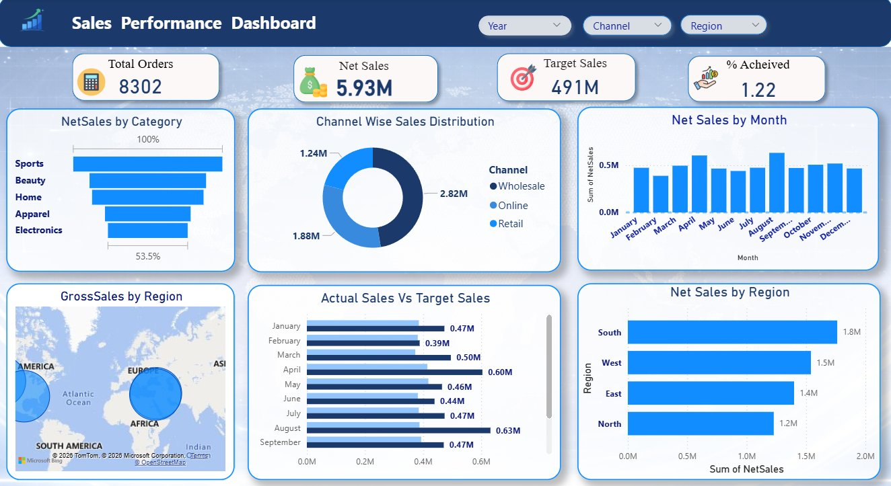

# Sales Performance Dashboard — Power BI

> An end-to-end interactive sales analytics dashboard built in Power BI, analysing ₹5.93M in net sales across 8,302 transactions, 5 regions, 3 channels, and 5 product categories for FY 2024.

---

## Dashboard Preview



---

## Project Overview

| Detail | Value |
|---|---|
| Tool | Microsoft Power BI Desktop |
| Domain | Sales Analytics |
| Data Period | FY 2024 (January – December) |
| Total Transactions | 8,302 sales records |
| Total Net Sales | ₹5.93M |
| Data Sources | 5 Excel files |
| Dashboard Pages | 4 (Summary Dashboard, KPI & Channel, Monthly Trend, Regional Sales) |
| Canvas Size | 1280 × 720 px (16:9 widescreen) |

---

## Business Problem

Sales teams needed a single, interactive view to answer four critical questions:

1. How are we tracking against annual targets overall?
2. Which months are we hitting or missing targets?
3. Which channels and regions are driving the most revenue?
4. Which product categories are performing best?

This dashboard answers all four in real time with interactive slicers for Year, Channel, and Region.

---

## Dashboard Pages

### 1. Summary Dashboard (Main Page)
The primary management-ready view — KPI cards, monthly trend, channel donut, regional bars, target vs actual comparison, category funnel, and geographic map. Fully interactive via 3 slicers.

### 2. KPI Cards and Channel Distribution
Focused view of the 4 KPI cards alongside monthly trend and channel-wise donut chart for quick executive review.

### 3. Monthly Sales Trend
Dedicated full-page trend view with target line overlay for deeper time-series analysis.

### 4. Sales by Region
Dedicated regional performance page with geographic breakdown of gross sales.

---

## Visuals Used

| Visual | Purpose | Fields |
|---|---|---|
| KPI Card — Total Orders | Count of orders processed | `MIN(OrderID)` |
| KPI Card — Net Sales | Total net revenue | `[Total Net Sales]` |
| KPI Card — Target Sales | Annual sales target | `[Total Target Sales]` |
| KPI Card — % Achieved | Target achievement rate | `[% Achieved]` |
| Line and Clustered Column Chart | Monthly Net Sales + Target line overlay | `NetSales`, `Target Sales (Filtered)`, `OrderDate` |
| Donut Chart | Channel-wise sales split | `Channel`, `NetSales` |
| Clustered Bar Chart | Net Sales by Region ranked | `Region`, `NetSales` |
| Clustered Bar Chart | Actual vs Target by month | `NetSales`, `Target Sales (Filtered)`, `Month` |
| Funnel Chart | Net Sales by Product Category | `Category`, `NetSales` |
| Map Visual | Gross Sales geographic distribution | `Region`, `GrossSales` |
| Slicers x3 | Interactive filters | `Year`, `Channel`, `Region` |

---

## Data Model

```
FactSales (8,302 rows — fact table)
   ├── CustomerID  →  DimCustomer [CustomerID]   Many-to-One
   └── ProductID   →  DimProduct  [ProductID]    Many-to-One

Targets (288 rows)
   └── Joined dynamically via DAX TREATAS on Region + Channel + YearMonth
```

Star schema design with FactSales as the central fact table. Targets table has no direct relationship and is linked through a virtual join using `TREATAS` in DAX — this allows target filtering to correctly respond to Region and Channel slicer selections simultaneously.

---

## Data Sources

| File | Description | Rows | Key Columns |
|---|---|---|---|
| `FactSales_csv.xlsx` | Core sales transactions | 8,302 | `OrderDate`, `NetSales`, `GrossSales`, `Channel`, `CustomerID`, `ProductID`, `YearMonth` |
| `DimCustomer_csv.xlsx` | Customer dimension | 800 | `CustomerID`, `Region`, `City`, `Segment`, `LoyaltyTier` |
| `DimProduct_csv.xlsx` | Product dimension | 150 | `ProductID`, `Category`, `Subcategory`, `Brand`, `ListPrice` |
| `Targets_csv.xlsx` | Monthly sales targets | 288 | `YearMonth`, `Region`, `Channel`, `TargetNetSales` |
| `InventorySnapshot_csv.xlsx` | Inventory snapshot | 150 | `ProductID`, `OnHandQty`, `ReorderPointQty` |

---

## DAX Measures

All measures are stored in a dedicated `Measures` table for clean model organisation.

```dax
Total Net Sales = SUM(FactSales[NetSales])
```

```dax
Total Target Sales =
CALCULATE(
    SUM(Targets[TargetNetSales]),
    TREATAS(
        SUMMARIZE(
            FactSales,
            DimCustomer[Region],
            FactSales[Channel],
            FactSales[YearMonth]
        ),
        Targets[Region],
        Targets[Channel],
        Targets[YearMonth]
    )
) / 100
```

```dax
% Achieved = DIVIDE([Total Net Sales], [Total Target Sales], 0)
```

```dax
Gap vs Target = [Total Net Sales] - [Total Target Sales]
```

```dax
Net Sales YTD = TOTALYTD([Total Net Sales], FactSales[OrderDate])

Target YTD = TOTALYTD([Total Target Sales], FactSales[OrderDate])

% Achieved YTD = DIVIDE([Net Sales YTD], [Target YTD], 0)
```

```dax
Channel % Share =
DIVIDE([Total Net Sales], CALCULATE([Total Net Sales], ALL(FactSales[Channel])), 0)

Region % Share =
DIVIDE([Total Net Sales], CALCULATE([Total Net Sales], ALL(DimCustomer[Region])), 0)
```

```dax
Filter Summary =
"Year: " & SELECTEDVALUE(FactSales[Year], "All") &
"  ·  Channel: " & SELECTEDVALUE(FactSales[Channel], "All") &
"  ·  Region: " & SELECTEDVALUE(DimCustomer[Region], "All")
```

---

## Key Insights

- **₹5.93M total net sales** across 8,302 transactions in FY 2024
- **August is the peak month** at ₹0.63M; February records the lowest at ₹0.39M
- **Wholesale dominates** channel distribution, followed by Online and Retail
- **South region leads** at ₹1.8M, followed by West (₹1.5M), East (₹1.4M), North (₹1.2M)
- **Sports and Beauty** are the top-performing product categories by net sales
- **Target gap persists** across most months — indicating an opportunity to revisit mid-year sales interventions or revise target calibration methodology
- All visuals respond instantly to Year, Channel, and Region slicer selections

---

## Dashboard Layout

```
┌──────────────────────────────────────────────────────────────────┐
│  HEADER: Sales Performance Dashboard    Year  Channel  Region   │
├───────────┬───────────┬───────────┬──────────────────────────────┤
│  Total    │ Net Sales │  Target   │  % Achieved                 │
│  Orders   │  ₹5.93M   │  Sales    │  KPI Card                   │
│  8302     │           │           │                             │
├───────────┴──────┬────┴────┬──────┴─────────────┬───────────────┤
│  NetSales by     │ Channel │  Net Sales by Month │ GrossSales   │
│  Category Funnel │  Donut  │  + Target Line      │  Map         │
├──────────────────┴─────────┴─────────────────────┴───────────────┤
│  Actual Sales vs Target Sales (monthly)  │ Net Sales by Region  │
└──────────────────────────────────────────┴──────────────────────┘
```

---

## How to Run This Project

```bash
git clone https://github.com/YOUR_USERNAME/sales-performance-dashboard.git
cd sales-performance-dashboard
```

Open `Sales_Analysis.pbix` in **Power BI Desktop** (free — [powerbi.microsoft.com](https://powerbi.microsoft.com)).

If prompted to update data source paths, point to the `/data` folder. Then click **Home → Refresh** to reload all data.

Use the Year, Channel, and Region slicers to explore the dashboard interactively.

---

## Repository Structure

```
sales-performance-dashboard/
│
├── Sales_Analysis.pbix          ← Power BI dashboard file
├── README.md                    ← Project documentation
├── dashboard_preview.png        ← Full dashboard screenshot
│
└── data/
    ├── FactSales_csv.xlsx
    ├── DimCustomer_csv.xlsx
    ├── DimProduct_csv.xlsx
    ├── Targets_csv.xlsx
    └── InventorySnapshot_csv.xlsx
```

---

## Skills Demonstrated

- Power BI data modelling — star schema, Many-to-One relationships
- Advanced DAX — `TREATAS`, `TOTALYTD`, `DIVIDE`, `CALCULATE`, `SUMMARIZE`, `SELECTEDVALUE`, `ALL`
- Time intelligence — YTD and MTD aggregations
- Conditional formatting — rule-based bar coloring (green / amber / red)
- Power Query (M) — data cleaning, type conversion, YearMonth column creation
- Dashboard UX design — layout hierarchy, color consistency, visual storytelling
- Cross-table filtering via virtual relationships using `TREATAS`
- Business insight generation from raw transactional data

---

## Author

**Atmakuri Purushotham Sai** — Data Analyst, Hyderabad, India

[](https://www.linkedin.com/in/sai-purushotham-b36545279)
[](https://github.com/Purushothamatmakuri)
[](mailto:saipurushotham100@gmail.com)

---

## License

This project is open source under the [MIT License](LICENSE).
